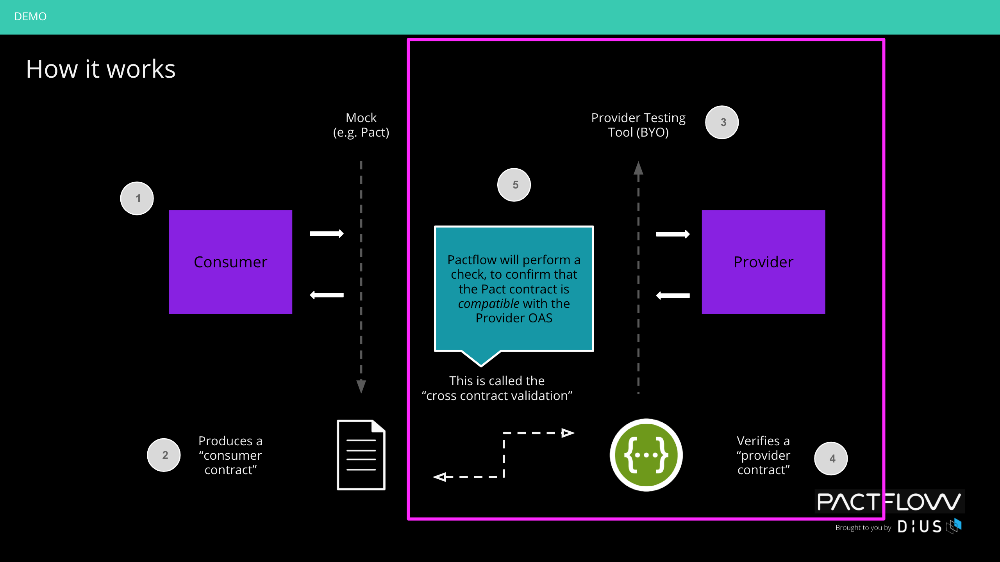
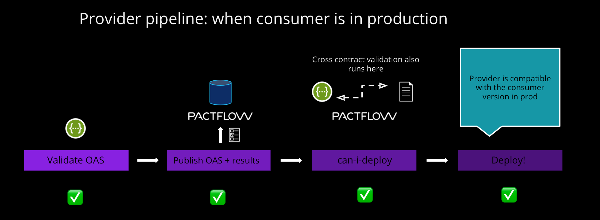

# Example Postman Provider

This is an example "Product" API Provider, to demonstrate the new bi-directional contract capability of Pactflow (previously referred to as Provider driven contracts, or collaborative contracts). It:

- Is an API written in Express JS
- Has a Postman 2.1 collection (see `./test/PactflowPorductsAPI.postman_collection.json`)
- Uses Newman to test the API against the postman collection
- Uses [Postman2OpenAPI](https://github.com/kevinswiber/postman2openapi) to convert a Postman collection to an OAS for use in the bi-directional contracts feature.

What is uploaded to Pactflow is an OpenAPI specification that represents what you actually tested from the Postman collection, to give us confidence it is compatible with a Pact consumer.

It is using a public tenant on Pactflow, which you can access [here](https://testdemo.pactflow.io/) using the credentials `dXfltyFMgNOFZAxr8io9wJ37iUpY42M`/`O5AIZWxelWbLvqMd8PkAVycBJh2Psyg1`. The latest version of the Example Consumer/Example Provider pact is published [here](https://testdemo.pactflow.io/pacts/provider/pactflow-example-provider-postman/consumer/pactflow-example-consumer/latest).

In the following diagram, you can see how the provider testing process works.

When we call "can-i-deploy" the cross-contract validation process kicks off on Pactflow, to ensure any consumer consumes a valid subset of the OAS for the provider.

When you run the CI pipeline (see below for doing this), the pipeline should perform the following activities (simplified):

## Pre-requisites

**Software**:

- Tools listed at: https://docs.pactflow.io/docs/workshops/ci-cd/set-up-ci/prerequisites/
- A pactflow.io account with an valid [API token](https://docs.pactflow.io/docs/getting-started/#configuring-your-api-token)

### Environment variables

To be able to run some of the commands locally, you will need to export the following environment variables into your shell:

- `PACT_BROKER_TOKEN`: a valid [API token](https://docs.pactflow.io/docs/getting-started/#configuring-your-api-token) for Pactflow
- `PACT_BROKER_BASE_URL`: a fully qualified domain name with protocol to your pact broker e.g. https://testdemo.pactflow.io

## Usage

- `make test` - run the newman testing suite
- `make convert` - converts the Postman collection to an OAS for bi-directional contract (automatically done by the `make fake_ci` step)
- `make fake_ci` - run the CI process, but locally

## Caveats

1. OAS is generated by the examples attached to each request. If there are mulitple overlapping paths, the last one will clobber earlier ones (use the Postman examples feature to overcome this)
1. Postman tests are attached to the "item" level, not the examples. So it's possible to put in examples that don't actually match reality and aren't tested.
